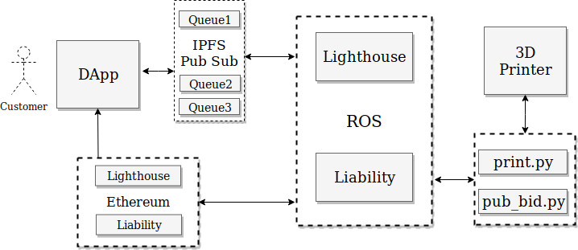

# Robonomics-2018
AIRA Lab Summer School Practice: Industry 4.0 case setup.

## Architecture

## How to use this guide
It is recommended to read [my blog post](http://agryaznov.com/reports/2018/08/29/robonomics-2018.html) (Russian) for the task introduction. Then go ahead with the daily step-by-step guides:
    
+ [Day-1-Guide.md](https://github.com/agryaznov/robonomics-2018/blob/master/Day-1-Guide.md)
+ [Day-2-Guide.md](https://github.com/agryaznov/robonomics-2018/blob/master/Day-2-Guide.md)
+ [Days-3-4-Guide.md](https://github.com/agryaznov/robonomics-2018/blob/master/Days-3-4-Guide.md)

For setting up the DApp component, please refer to [Anatoly Belchikov's repo](https://github.com/belya/aira-3d-printer-client)